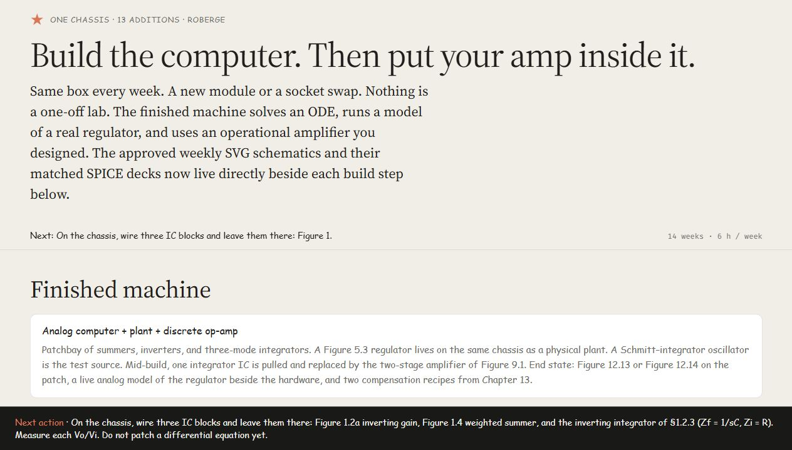

# Roberge One-Box Op-Amp Design Capstone

This repository develops one progressively assembled ±15 V analog-computing chassis across Weeks 0–13. The machine begins with LM301A computing blocks, gains a physical regulator plant and persistent test oscillator, replaces one stock integrator amplifier with a discrete Q1–Q13 design, adds reset/operate/hold modes, runs nonlinear and fourth-order computations, and ends with separate compensation experiments.

[](https://az9713.github.io/op-amp-design/capstone.html)

**[Open the live capstone](https://az9713.github.io/op-amp-design/capstone.html)**

## Textbook foundation

“Roberge” refers to James K. Roberge’s MIT textbook, *Operational Amplifiers: Theory and Practice*. The weekly progression reconstructs, adapts, and extends circuits from that book into one cumulative teaching chassis. Read the source as either the [MIT OpenCourseWare textbook PDF](https://ocw.mit.edu/courses/res-6-010-electronic-feedback-systems-spring-2013/res6_010_s_13_coursetextbook.pdf) or the [navigable Engineering LibreTexts edition](https://eng.libretexts.org/Bookshelves/Electrical_Engineering/Electronics/Operational_Amplifiers%3A_Theory_and_Practice_(Roberge)).

The book remains the historical circuit authority. Project-added values, protection, fixtures, and build completions are explicitly labeled as derived or proposed rather than attributed to Roberge.

The central engineering rule is stronger than “the schematic looks connected”:

> Every published SVG schematic and its SPICE deck are projections of the same canonical component/pin/net graph, and both projections are independently parsed and compared back to that graph.

## Start here

- [Integrated capstone](capstone.html) — the W00–W13 build narrative with 44 approved schematic sheets and matched SPICE/receipt links.
- [Complete development journey](development-journey.html) — the early drawing attempts, the representation change, major corrections, gates, and current limitations.
- [Pre-flight decisions](docs/preflight-decisions.html) — the sixteen binding project decisions and deferred-project ledger.
- [Implementation plan](docs/implementation-plan.html) — the gated production and verification strategy.
- [Weekly electrical specification](docs/weekly-electrical-specification.html) — the integrated electrical contract for every weekly state.
- [Canonical-toolchain ADR](spec/decisions/adr-001-canonical-toolchain.md) — why the project uses a canonical graph plus deterministic SVG/SPICE projectors.

Open `capstone.html` directly in a browser. Each weekly schematic set is collapsible; Week 0 is expanded initially.

## What is in the repository

```text
capstone.html                    Integrated weekly teaching project
development-journey.html        Evidence-grounded project history
circuits/
  schema/                        Canonical circuit-graph contract
  models/                        Model registry and provenance policy
  weeks/                         W00–W13 graphs and case manifests
layout/weeks/                    Non-electrical placement/routing overlays
tools/circuit_pipeline/          SVG/SPICE projectors, parsers, simulator runner
tests/                           Schema, connectivity, visual, weekly, and simulation tests
generated/                       Reviewed SVG, SPICE, and connectivity artifacts
spec/decisions/                  Gates, source maps, production decisions, acceptances
docs/                            Review pages, plans, gates, and historical HTML
drafts/                          Preserved specification and audit history
```

Legacy coordinate-first generators and their HTML outputs are retained as historical evidence. They are not electrical authorities.

## Electrical-authority model

```text
Roberge source + user decisions + engineering additions
                         |
                         v
              canonical graph.json
                  /             \
       layout overlay          model binding
              |                     |
              v                     v
        semantic SVG             SPICE deck
              \                     /
               independent parsers
                         |
                         v
              connectivity receipt
```

The canonical graph owns:

- stable physical component identities and logical pins;
- named electrical nets and hierarchy ports;
- cumulative weekly inheritance and explicit deltas;
- separate experiment configurations and deliberate open circuits;
- installed, inactive, removed, reserved, and temporary-fixture states;
- ideal/realistic model bindings and source-evidence labels.

Layout overlays may position symbols, select hierarchy views, and define routing corridors. They cannot create components, pins, nets, values, or models.

## Project progression

| Week | End-of-week focus |
|---|---|
| W00 | Permanent ±15 V infrastructure, PGND/SGND tie, bypassing, commissioning loads |
| W01 | LM301A inverter, weighted summer, and first integrator |
| W02 | Sign-correct first-order computer: SUM1 → INV1 → INT1 |
| W03 | Figure 3.1 compensation comparison and restored first-order loop |
| W04 | Damped second-order computer and separate return-ratio fixture |
| W05 | Build-completed low-power Figure 5.3 regulator plant |
| W06 | Dedicated INT3 Schmitt–integrator oscillator |
| W07 | Intentionally incomplete discrete input pair in SLOT.INT1 |
| W08 | Permanent Q1–Q11 open-loop amplifier subset and INT1 bring-up |
| W09 | Complete Q1–Q13 amplifier, inverter tests, and restored discrete INT1 |
| W10 | PNP current-mirror load and equal-condition hold comparison |
| W11 | Reset/operate/hold hardware, DUT error fixtures, grounded half-wave rectifier |
| W12 | Fourth-order Butterworth, Van der Pol, and regulator analog twin |
| W13 | Seven separate fixed/adjustable compensation configurations |

## Running the checks

The validation and projection core uses the Python standard library. Python 3.13 is the recorded development runtime. ngspice 47 is used for the executable simulation subset.

### Where the SPICE files are

The repository currently contains 98 tracked `.cir` decks. The main, human-reviewed weekly decks are beside their SVG counterparts:

- `generated/weeks00_04/` — Weeks 0–4;
- `generated/weeks05_06/` — Weeks 5–6;
- `generated/weeks07_08/` — Weeks 7–8;
- `generated/week09_reconciled/` and `generated/week09/proof/` — Week 9 publication and executable proof cases;
- `generated/week10/` through `generated/week13/` — Weeks 10–13.

Every schematic card in the [live capstone](https://az9713.github.io/op-amp-design/capstone.html) has a **SPICE** link to its matched deck and a **connectivity receipt** link showing the SVG/SPICE comparison. Files under `tests/electrical/` and `spec/decisions/probes/` are test fixtures, not weekly build sheets.

Validate one canonical graph:

```powershell
python tools/validate_circuit_graph.py circuits/weeks/w13/graph.json
python tools/validate_circuit_graph.py --check-canonical circuits/weeks/w13/graph.json
```

Project a graph variant to matched SVG/SPICE artifacts:

```powershell
python -m tools.circuit_pipeline circuits/weeks/w13/graph.json `
  --variant W13.ONEPOLE_AMP1 `
  --fidelity ideal `
  --layout layout/weeks/w13/onepole-amp1.json `
  --view main `
  --output-dir generated/example
```

Run the complete test suite:

```powershell
python -m unittest discover -s tests -v
```

Current repository snapshot: **113 tests pass**.

## Verification status

The project deliberately separates four gates:

| Gate | Current status | Meaning |
|---|---|---|
| Schema/state | Pass | Graphs validate; weekly deltas and references are checked |
| SVG/SPICE connectivity | Pass for published pairs | Parsed SVG and SPICE terminal maps match the canonical graphs |
| Weekly topology/presentation | User-approved W00–W13 | Review batches and the Week 9 publication style were accepted |
| Quantitative electrical performance | Incomplete/blocked | Topology acceptance is not a performance claim |

Important open evidence:

- The Week 9 vertical proof executed under ngspice, but its balance, 1 Hz inverter-gain, and restored-integrator polarity assertions failed. Those failures remain open.
- Lawfully redistributable, characterized models and exact package mappings are unavailable for several historical semiconductor parts.
- Week 12 regulator-twin values and Week 13 compensation values depend on measurements from assembled hardware.
- A current Week 0 visual defect routes the PGND line over a dummy-load resistor. Its graph/SVG/SPICE connectivity agrees, but the sheet still needs publication rerouting.

See [Gate 2 status](spec/decisions/gate-2-week09-status.md) and the [development journey](development-journey.html) for the full claim boundary.

## Source material and copyright

The original locally downloaded Roberge PDF, extracted textbook figure crops, and a saved third-party Arrow article are intentionally **not redistributed** in this repository. Use the public [MIT OpenCourseWare PDF](https://ocw.mit.edu/courses/res-6-010-electronic-feedback-systems-spring-2013/res6_010_s_13_coursetextbook.pdf) or [LibreTexts edition](https://eng.libretexts.org/Bookshelves/Electrical_Engineering/Electronics/Operational_Amplifiers%3A_Theory_and_Practice_(Roberge)). See [SOURCE_MATERIALS.md](SOURCE_MATERIALS.md) for acquisition and placement notes.

Generated circuits distinguish source-verified topology from project-derived or proposed build completions. A practical value is never silently described as a historical Roberge value.

## Deferred companion projects

The following remain separate workstreams:

1. Physical front-panel patch-cord and jack-routing drawings.
2. A low-voltage or rail-to-rail redesign; it must not silently alter the ±15 V curriculum.
3. Parallel modern-component implementations.
4. PCB, enclosure, harness, protection, thermal, and construction documentation.

## Repository history

The preserved early files document several coordinate-first and Schemdraw approaches. They established the visual vocabulary and exposed failure modes, but could not prove electrical connectivity. `docs/schematic-methods.html` correctly diagnosed that “the gap is the representation, not the coordinates.” The current toolchain implements that insight by making the net graph authoritative and every drawing a checked projection.

No open-source license has been assigned. Copyright and reuse rights therefore remain with their respective owners.
